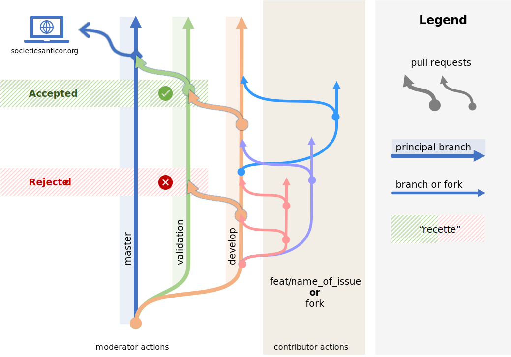

# Contributing to Société AntiCOR

:+1::tada: First off, thanks for taking the time to contribute! :tada::+1:

The following is a set of guidelines for contributing to Société AntiCOR. These are mostly guidelines, not rules. Use your best judgment, and feel free to propose changes to this document in a pull request.

#### Table Of Contents

[I don't want to read this whole thing, I just have a question!!!](#i-dont-want-to-read-this-whole-thing-i-just-have-a-question)

[What should I know before I get started?](#what-should-i-know-before-i-get-started)
  * [Checking Issues & code](#checking-ssues-&-code)
  * [Installation](#installation)

[How Can I Contribute?](#how-can-i-contribute)
  * [Reporting Bugs](#reporting-bugs)
  * [Suggesting Enhancements](#suggesting-enhancements)
  * [Pull Requests](#pull-requests)
  * [Git Flow](#git-flow)
  * [Recognition](#recognition)


[Styleguides](#styleguides)
  * [Git Commit Messages](#git-commit-messages)
  * [JavaScript Styleguide](#javascript-styleguide)
  * [Coding Style guide](#coding-style-guide)
  * [Tests Styleguide](#tests-styleguide)
  * [Documentation Styleguide](#documentation-styleguide)


## I don't want to read this whole thing I just have a question!!!

Open An issue starting with [Question] in the title. Else, join the conversation on the slack : https://join.slack.com/t/societesanticor/shared_invite/zt-hpaqwfh2-BH1q9l9iterYMkcrrxUuxw .

## What should I know before I get started?

### Checking Issues & code

Check into the issues list if you want to try something, or find it on the code side.

### Installation

Proceed with the installation in the [README.md](./README.md)

## How Can I Contribute?

### Reporting Bugs
If you find bugs,
- Please include:
  - If it is a **back-end** or a **front-end** issue,
  - If necessary, include a capture with a highlight.
  - PHP version
  
#### Before Submitting A Bug Report
- Check if the bug has been already reported in the closed issue.

### Suggesting Enhancements

Add an issue with a [Enhancement] at the beginning of the issue.

### Pull Requests

- Fork
- Make your changes **in your own repository**.
- When you are ready, submit a Pull Request

### Git Flow



#### Prinicpal Branches
- master 
    - production
- validation 
    - branch which holds the configuration being tested.
    - pull request to master
- develop
    - intergration branch for incoming contributions
    - pull request to validation


### Recognition

- After your first pull request has been approved,
- You can submit another pull request to update the README.md in the CONTRIBUTING section to add your name.

## Styleguides

### Git Commit Messages

Steps ? // TODO

### JavaScript Styleguide

Steps ? // TODO PHP ?

### Coding Style guide

Steps ? // TODO PHP ? PSR-2 ?

### Tests Styleguide

Steps ? // TODO


#### Example

```
// TODO: UI TEST ? PHP TEST ?

```

### Documentation Styleguide

Steps ? // TODO

#### Example

```php
// TODO PHP DOCS ?
```
